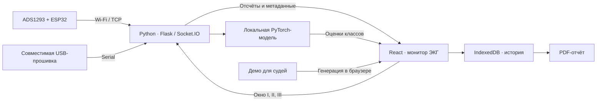

# CardioScan

**ЭКГ в реальном времени: от подключения ESP32 до графиков, локального анализа и истории исследований.**

CardioScan — прототип для визуализации и исследования электрокардиограмм. Приложение принимает поток с ESP32, показывает четыре отведения, анализирует временные окна локальной нейросетью и сохраняет записи. Отдельный режим позволяет судьям хакатона посмотреть графики без оборудования и сервера.

> Исследовательский проект, не медицинское изделие. Результаты модели не являются диагнозом. Демонстрационные сигналы предназначены для проверки интерфейса, а не для оценки здоровья или точности модели.

[Демо для судей](#демо-для-судей) · [Локальный запуск](#локальный-запуск) · [ESP32](#подключение-esp32) · [Модели](#анализ-и-модели) · [Тесты](#проверки) · [Документация](#документация)

## Возможности

- **Потоковая ЭКГ:** подключение по Wi‑Fi/TCP или USB с совместимой прошивкой.
- **Четыре графика:** I, II, вычисляемое III = II − I и V1.
- **Временная шкала:** окна 2, 5 и 10 секунд, временные метки устройства, отображение пропусков, пауза графика и выбор масштаба.
- **Анализ во время записи:** после накопления первых 10 секунд данных, затем не чаще раза в 2 секунды при поступлении новых отсчётов. Последний результат остаётся видимым при пересчёте.
- **Анализ изображений ЭКГ:** отдельная локальная модель для загруженных изображений.
- **История и PDF:** сохранение исследований в IndexedDB и формирование отчётов.
- **Опросник:** отдельное заполнение данных и симптомов; результат потокового анализа не требует прохождения опросника.
- **Демо для судей:** искусственный сигнал прямо в браузере, без ESP32 и Python-сервера.
- **Интерфейс:** русский, английский и казахский языки, светлая и тёмная темы.

## Демо для судей

Для просмотра графиков достаточно Node.js и npm. Плата, Python, веса моделей и API-ключи не нужны.

Из корня клонированного репозитория:

```sh
cd frontend
npm ci
npm start
```

Откройте **http://localhost:3000**:

1. Перейдите в **«Монитор ЭКГ»**.
2. Выберите **«Демо для судей»**.
3. Нажмите **«Начать запись»**.
4. Посмотрите I, II, III и V1, переключите размер окна и масштаб, попробуйте заморозить график.
5. Нажмите **«Завершить запись»**, чтобы остановить показ.

Демо генерирует 125 отсчётов в секунду с условным ритмом 72 уд/мин. Данные явно помечены как искусственные. В этом режиме диагностический анализ не выполняется и запись пациента в истории не создаётся. Wi‑Fi остаётся режимом по умолчанию.

В PowerShell при запрете запуска `npm.ps1` используйте `npm.cmd` вместо `npm`, например `npm.cmd start`.

## Как устроен проект



Демо использует графики приложения, но не отправляет данные в модель и историю. Desktop-оболочка построена на Tauri 2; основной интерфейс доступен и в браузере.

| Часть | Технологии |
| --- | --- |
| Интерфейс | React 19, React Router, Tailwind CSS, Zustand, Canvas |
| Связь с приложением | Socket.IO, HTTP REST |
| Сервер | Python, Flask, Flask-SocketIO, pyserial |
| Анализ потока | PyTorch, NumPy, SciPy |
| Анализ изображений | Ultralytics / YOLO |
| Локальное хранение | IndexedDB |
| Desktop | Tauri 2, Rust |
| Устройство | ESP32, ADS1293, Arduino |

## Локальный запуск

### Требования

- Python **3.11** — эта версия используется в Dockerfile.
- Node.js **20** и npm — эта версия Node используется в workflow сборки.
- Веса моделей в `backend/model/` для нужного вида анализа.
- Для оборудования: ESP32 и подходящая прошивка; для реальных измерений — модуль ADS1293 и проверенная схема подключения.

Python-зависимости включают PyTorch и TensorFlow; их установка может занять заметное время и место на диске. Для демонстрации графиков этот шаг можно пропустить.

### 1. Сервер

Команды для Windows PowerShell, из корня репозитория:

```powershell
py -3.11 -m venv .venv
.\.venv\Scripts\python.exe -m pip install --upgrade pip
.\.venv\Scripts\python.exe -m pip install -r backend/requirements.txt
.\.venv\Scripts\python.exe backend/start.py
```

Для Linux/macOS:

```sh
python3.11 -m venv .venv
.venv/bin/python -m pip install --upgrade pip
.venv/bin/python -m pip install -r backend/requirements.txt
.venv/bin/python backend/start.py
```

`backend/start.py` запускает локальный сервер на **127.0.0.1:6767**. Оставьте терминал открытым. Проверить доступность можно по адресу **http://localhost:6767/api/health**: поля `three_lead`, `yolo` и `keras` показывают, какие модели загрузились.

### 2. Интерфейс

В другом терминале:

```sh
cd frontend
npm ci
npm start
```

Откройте **http://localhost:3000**. В текущей конфигурации интерфейс обращается к серверу на `localhost:6767`.

На телефоне `localhost` означает сам телефон. Открытие интерфейса на другом устройстве не перенаправляет запросы к серверу на компьютере: для такого сценария потребуется настройка адресов API и сети.

### Настройки окружения

Для локального анализа ЭКГ **API-ключ не нужен**. Необязательные настройки можно задать через окружение или `backend/.env`:

| Переменная | Назначение |
| --- | --- |
| `MODEL_DIR` | Каталог весов; по умолчанию `backend/model` |
| `ECG_THREE_LEAD_MODEL` | Путь к файлу трёхканальной модели вместо стандартного `ecg_ads1293.pt` |
| `FLASK_SECRET_KEY` | Секрет Flask для конкретной установки |
| `GROQ_API_KEY` | Необязательный ключ внешнего сервиса текстовых заключений; не используется для локальной классификации потока |

`.env` исключён из Git. Внешние текстовые сервисы — отдельная функция: для них может требоваться интернет, а отправляемые данные покидают локальный компьютер.

## Подключение ESP32

Основной скетч: **[esp32_ecg_wifi.ino](arduino/esp32_ecg_wifi/esp32_ecg_wifi.ino)**. Он рассчитан на классический **ESP32 DevKit V1 + ADS1293**, плата в Arduino IDE — **ESP32 Dev Module**, пакет ESP32 Arduino core 3.x.

| Параметр | Значение |
| --- | --- |
| Wi‑Fi устройства | `CardioScan-ESP32` |
| Пароль | `12345678` |
| TCP-адрес | `192.168.4.1:3333` |
| Частота по настройкам ADS1293 | Около 853,33 отсчёта/с |
| Одновременные TCP-клиенты | Один |
| Serial | 115200 бод; основной ADS1293-скетч выводит диагностику |

1. Загрузите скетч, следуя [инструкции по оборудованию](arduino/README.md).
2. Подключите компьютер к сети `CardioScan-ESP32`. Отсутствие интернета в этой сети нормально.
3. Запустите сервер и интерфейс.
4. В мониторе выберите **Wi‑Fi** и начните запись.
5. Для первого анализа дождитесь минимум 10 секунд принятых данных. Запись продолжается до остановки; размер окна графика не ограничивает её длительность.

**USB-запись требует прошивку, отправляющую сами отсчёты на 115200 бод.** Диагностические строки основного ADS1293-скетча не являются потоком ЭКГ. Перед подключением приложения по USB закройте монитор порта Arduino IDE и другие программы, использующие COM-порт.

Формат потока:

```text
timestamp_us,sequence,lead_I_raw,lead_II_raw,lead_III_raw,V1_raw,lost_samples
```

Время передаётся в микросекундах; I, II и V1 — сырые коды АЦП, III вычисляется как II − I. Это не значения в мВ. Приложение использует номера кадров и временные метки для контроля пропусков. На самой ESP32 файл записи не создаётся.

> При подключении человека нельзя одновременно использовать USB, зарядку или неизолированное оборудование. Питание от аккумулятора само по себе не подтверждает электрическую безопасность. Распиновка, защита входов и схема RLD требуют проверки до измерений. Подробности — в [инструкции Arduino](arduino/README.md).

## Анализ и модели

| Файл | Использование |
| --- | --- |
| `backend/model/ecg_ads1293.pt` | Поток I, II, III; окно 10 секунд, приведение к 100 Гц |
| `backend/model/best.pt` | Анализ изображений ЭКГ |
| `backend/model/best_ecg_model.h5` | Прежняя модель для одноканального ввода |
| `backend/model/meta_model_v3.pkl` | Отдельная модель оценки риска для совместимого входа |

V1 показывается и сохраняется, но в трёхканальную модель не подаётся. Опросник не блокирует результат ЭКГ; модель риска не вызывается для оценок `ecg_ads1293`, поскольку не обучалась на них.

Классы потоковой модели: `CD`, `HYP`, `MI`, `STTC`, `NORM`, `AF`, `NOISE`. При обнаружении `NOISE` диагностические классы скрываются. Короткие окна, некорректные временные метки и пропуски внутри анализируемого окна могут привести к отказу анализа. Последний успешный результат остаётся на экране с указанием позиции в записи.

### Ограничения

- Числа модели — **некалиброванные оценки классов**, не вероятности заболевания.
- Визуально регулярная искусственная кривая не является подтверждённой нормальной ЭКГ. Ответ `NORM` на ней не гарантирован.
- Для HYP сохранённая validation precision составляет около **0,378**. Это характеристика конкретной проверочной выборки, а не оценка вероятности заболевания у пользователя; ложные срабатывания требуют дальнейшего исследования.
- Качество на реальном ADS1293 требует отдельной проверки на размеченных записях устройства.
- Демонстрационный режим показывает интерфейс и не является проверкой качества нейросети.

Методика обучения, разбиение PTB-XL/Chapman, пороги и ограничения описаны в **[руководстве по моделям](backend/training/README.md)**. После замены весов сервер нужно перезапустить.

## История и данные

История хранится локально в **IndexedDB** браузера или desktop-приложения. Облачной синхронизации истории нет; разные браузеры и адреса приложения имеют отдельные хранилища. Очистка данных сайта может удалить записи — важные отчёты экспортируйте заранее.

При остановке обычной записи сохраняются принятые отсчёты, временные метки и метаданные; анализ использует только последнее окно. При включении внешнего текстового заключения применяются отдельные сетевые запросы. API предназначен для локального прототипа, а не для публичного доступа без дополнительной защиты.

## Сборка и другие способы запуска

### Frontend

```sh
cd frontend
npm run build:tauri
```

Результат — `frontend/build/`. Эта команда собирает интерфейс, но не установщик desktop-приложения.

Скрипт `npm run build` использует Unix-синтаксис переменной `BUILD_PATH` и пишет в `static/dist/`. Для эквивалентной сборки в PowerShell:

```powershell
cd frontend
$env:BUILD_PATH = '../static/dist'
npm.cmd run build:tauri
Remove-Item Env:BUILD_PATH
```

После этого локальный Flask-сервер может отдавать интерфейс по адресу **http://localhost:6767**.

### Desktop / Tauri

Для сборки нужны Rust, системные зависимости Tauri и подготовленный Python sidecar в `frontend/src-tauri/binaries/` с суффиксом целевой платформы. Команды из `frontend/`:

```sh
npm run tauri:dev
npm run tauri:build
```

Подготовку sidecar и платформенные шаги смотрите в [release workflow](.github/workflows/release.yml). В текущем workflow полноценный Python backend упаковывается для Windows; для macOS/Linux используются заглушки, поэтому локальный backend необходимо запускать отдельно. Наличие мобильной сборки также не означает наличие встроенного Python-сервера.

### Docker

Из корня репозитория:

```sh
docker compose up --build
```

Перед запуском создайте `backend/.env` — Compose ожидает этот файл, даже если он пустой. Контейнер публикует backend на порту `6767`; frontend запускайте отдельно. Текущий Dockerfile не собирает и не копирует frontend.

USB-устройства и доступ к сети ESP32 не настраиваются Compose автоматически. Для работы с оборудованием проще начать с локального Python-сервера.

## Структура репозитория

```text
CardioScan/
├── README.md                 # Обзор проекта и запуск
├── frontend/
│   ├── src/                  # Интерфейс, графики, демо, история и отчёты
│   └── src-tauri/            # Desktop/mobile-оболочка и конфигурация Tauri
├── backend/
│   ├── app.py                # REST API, Socket.IO, приём USB/TCP
│   ├── start.py              # Локальная точка входа / bundled backend
│   ├── ecg_protocol.py       # Разбор отсчётов и проверка данных
│   ├── ecg_inference.py      # Потоковый анализ
│   ├── ecg_three_lead.py     # Подготовка сигнала и архитектура модели
│   ├── model/                # Веса моделей
│   └── training/             # Подготовка датасетов, обучение и диагностика
├── arduino/                  # Прошивка ADS1293 и аппаратная инструкция
├── data/                     # Локальные датасеты и результаты обучения
├── static/                   # Каталог для веб-сборки Flask
├── Competitors/              # Исследование аналогов
├── .github/workflows/        # Автоматизация релизных сборок
├── Dockerfile
└── docker-compose.yml
```

Большие датасеты, временные файлы, `.env` и результаты обучения исключены из Git согласно [.gitignore](.gitignore).

## Проверки

Из корня, с установленными Python-зависимостями:

```sh
python -m unittest discover -s backend -p test_ecg_protocol.py
python -m unittest discover -s backend -p test_ecg_inference.py
python -m unittest discover -s backend/training -p test_pipeline.py
```

Проверка inference требует `backend/model/ecg_ads1293.pt`. Используйте Python из созданного виртуального окружения.

Тесты интерфейса:

```sh
cd frontend
npm test -- --watchAll=false --runInBand
```

Тесты покрывают разбор потока, временную шкалу, поведение записи, обновление анализа и работу демо без устройства. Успешные программные тесты не заменяют аппаратную проверку или оценку медицинской точности.

## Если что-то не работает

| Симптом | Что проверить |
| --- | --- |
| Нет ESP32, нужно показать проект | Выберите «Демо для судей» — сервер и ключи не нужны |
| Сервер недоступен | Запущен ли `backend/start.py`, отвечает ли `/api/health`, свободен ли порт 6767 |
| Пустой график Wi‑Fi | Подключён ли компьютер к `CardioScan-ESP32`, доступен ли TCP 3333, начата ли запись |
| USB-порт занят | Закройте монитор Arduino IDE и другие приложения, использующие этот COM-порт |
| USB подключён, но отсчётов нет | Прошивка должна передавать CSV-отсчёты, а не только диагностические сообщения |
| «Нужно минимум 10 секунд» | Запишите 12–15 секунд; важна длительность принятых данных, а не только таймер интерфейса |
| Ошибка пропусков | Проверьте питание и транспорт; повторите запись без потерь |
| Модель недоступна | Проверьте веса в `backend/model/` и журнал запуска, затем перезапустите сервер |
| HYP на тестовой кривой | Это известное ограничение генератора и модели; не трактуйте искусственный сигнал как подтверждённый NORM |
| Ошибка внешнего текстового сервиса | Проверьте его настройки и интернет; ключ не требуется для локальной классификации ЭКГ |

## Документация

- [Подключение ADS1293 и загрузка прошивки](arduino/README.md)
- [API и формат потока](backend/api_guide.md)
- [Обучение, экспорт и ограничения моделей](backend/training/README.md)
- [Исследование аналогов](Competitors/COMPETITIVE_RESEARCH.md)
- [Сборка релизов](.github/workflows/release.yml)

## Лицензирование

В корне репозитория пока нет отдельного файла `LICENSE`. Условия использования кода следует согласовать с авторами проекта. Используемые библиотеки, модели и датасеты имеют собственные условия лицензирования; публичная доступность репозитория сама по себе их не заменяет.
